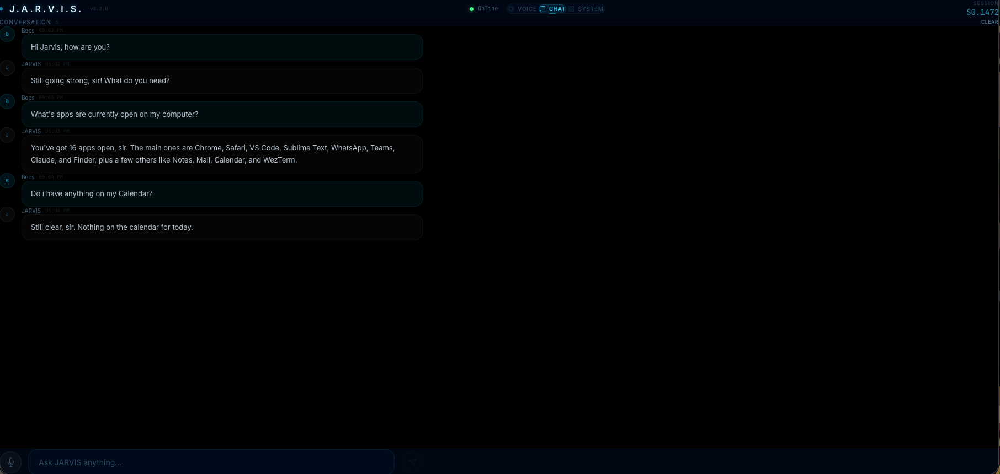
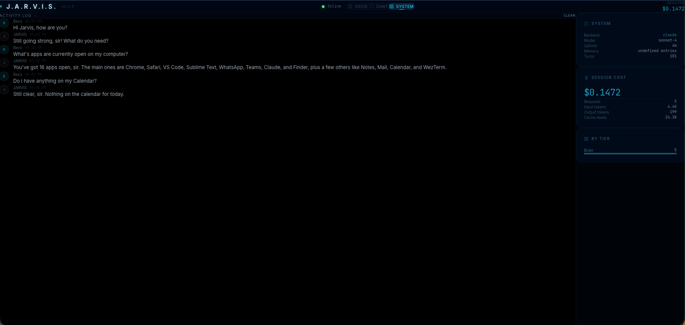

<p align="center">
  
</p>

<h1 align="center">J.A.R.V.I.S.</h1>
<h3 align="center">The open-source JARVIS for your Mac: talk to it, let it act, run it fully offline.</h3>

<p align="center">
  <a href="https://github.com/bertrandmbanwi/Jarvis/actions/workflows/ci.yml"></a>
  
  
  
  <a href="LICENSE"></a>
</p>

<p align="center">
  <a href="#suit-up-quick-start">Quick start</a> ·
  <a href="HOW-TO.md">Setup guide</a> ·
  <a href="docs/ROADMAP.md">Roadmap</a> ·
  <a href="CONTRIBUTING.md">Contributing</a>
</p>

---

Say "Hey JARVIS" and it answers in a British voice. You can ask it to check your calendar, read the screen, fill a web form, write code, or brief you every morning. It works through 106 tools on your Mac: apps, files, Chrome, email, calendar, notes, the shell and the web. Anything risky waits for your approval.

| | |
|---|---|
| 🎙️ **Voice first** | Wake word, local speech-to-text and text-to-speech, and interruptions. Press **Live** for a full-duplex conversation on OpenAI GPT-Live. |
| 🧠 **Your choice of models** | OpenAI (GPT-6.1 Sol / GPT-6 Luna) by default, Claude as an option, or **fully offline** on Ollama/MLX with Apple's on-device model for quick replies. |
| 🛠️ **Acts, not just answers** | macOS control, a Chrome extension, a Playwright browser agent with computer use, and Codex or Claude Code for coding tasks. |
| 🔌 **MCP both ways** | Use any MCP server's tools, or make JARVIS's tools available to Claude Code, Cursor and Codex. |
| 📚 **Agent Skills** | Drop in `SKILL.md` skills (the open format used by Claude and Codex). Ships with a morning briefing and meeting prep. |
| 📱 **Everywhere** | Cinematic web UI, desktop overlay, phone access via Cloudflare Tunnel, and Telegram or iMessage with approval prompts. |
| 🔒 **Safe by default** | Human approval for high-risk actions, local-origin checks, PIN-protected remote access, and secrets in the macOS Keychain. |

```bash
git clone https://github.com/bertrandmbanwi/Jarvis.git && cd Jarvis
./setup.sh && echo 'OPENAI_API_KEY=sk-...' > .env     # or OFFLINE_MODE=true for local models only
./start.sh full
```

## "Good evening, sir. I've prepared a summary of your system."

JARVIS lives on your Mac. Talk to it, type in the chat, or let it operate your computer. It can see your screen, manage your files, browse the web, drive your Chrome browser, and remember your preferences across sessions.

Each request goes to the right model tier: a fast model for quick lookups, a stronger one for conversation and tool use, and deep reasoning for multi-step plans. You can run it on OpenAI, on Anthropic, or entirely on local models.

<p align="center">
  
</p>

## The Arc Reactor (Features)

**Voice Interaction**
Speak naturally and JARVIS responds with a warm British accent. Powered by Moonshine ONNX (primary STT, low hallucination) with faster-whisper as fallback, and Kokoro TTS with chunked Opus streaming for sub-second latency. Wake word detection ("Hey JARVIS") runs continuously in the background via OpenWakeWord.

**Cinematic Web UI**
A GLSL shader-driven Three.js particle orb with 2,400 particles across three shells, simplex noise displacement, electric arcs, dust motes, and holographic rings. The orb pulses and reacts to JARVIS' state: idle, listening, thinking, speaking, error. Three views: Voice (the orb), Chat (message interface), and System (dashboard with live cost tracking). Optional PIN protection is available for mobile access.

**Desktop Overlay (macOS)**
A native Swift overlay that floats above all windows in the bottom-right corner. Shows JARVIS' current state (Standing By, Listening, Processing, Speaking) with a miniature Three.js particle orb and live conversation text. Connects via WebSocket, launches automatically with `./start.sh full`, and supports `Control+Option+J` global voice activation. Built with WKWebView for transparent rendering over your desktop.

**Chrome Extension (Browser Bridge)**
A Manifest V3 Chrome extension that gives JARVIS direct control over your browser. Manages tabs, navigates pages, fills forms, clicks elements, takes screenshots, reads page content, and executes scoped JavaScript. Auto-reconnects to JARVIS using a `chrome.alarms` keepalive that survives service worker termination, so the extension comes online automatically when JARVIS starts. No manual interaction needed.

**Browser Automation (Playwright)**
A full Playwright-driven Chromium browser that JARVIS controls autonomously for complex multi-step workflows. Fill forms, click buttons, log into sites, apply to jobs, download files. Persistent browser profile means sessions and cookies survive restarts. The Chrome extension handles lightweight tab operations; Playwright handles deep page automation.

**macOS System Control**
106 built-in tools across 17 categories (plus any MCP server you connect): open and close apps, adjust volume and brightness, manage files, execute shell commands, take screenshots with OCR, search the web, check weather, query free public-data APIs, read Gmail, manage Apple Notes, and delegate coding tasks to OpenAI Codex CLI or Claude Code.

**Multi-Agent Coordination**
Complex requests are automatically decomposed into subtasks by the planner agent, then executed in parallel or sequence by specialized executor agents. The QA agent verifies task quality, and the UI shows real-time plan progress with per-subtask status.

**Memory and Learning**
SQLite-backed semantic memory with full-text search stores conversation context. JARVIS learns your implicit preferences, remembers explicit facts ("my dog's name is Max"), and improves its task planning based on past successes and failures. A success tracker logs task outcomes for long-term analysis.

**Settings and Runtime Configuration**
A REST API (`/api/settings`) and an in-UI Settings Panel let you adjust preferences at runtime: model tiers, cost alerts, TTS voice, and more. Non-secret changes persist to `.env`; API keys updated through the API are stored in the secure keyring backend, which maps to macOS Keychain on a normal Mac install.

**Operational Guardrails**
Every tool has a formal permission classification and redacted audit trail. Requests, background jobs, and tool executions share trace IDs, with spans written to JSONL for local diagnostics. SQLite stores are versioned through migrations, and long-running chat jobs can be queued through durable `/jobs` endpoints.

**Conversation Quality Monitor**
Responses are automatically checked for quality issues: length limits for TTS, character consistency, response structure, and formatting. The QA verification agent retries tasks that do not meet quality thresholds.

**Work Sessions**
Long-running coding sessions persist to disk and restore automatically on restart, so multi-step development tasks survive JARVIS restarts without losing context.

**Structured Prompt Templates**
Task-specific prompt templates (build, feature, fix, refactor, research) guide the planner with structured formats and safe defaults.

**Multi-Device Audio Routing**
Connect from your Mac, phone, and tablet simultaneously. Each device registers independently and audio is routed only to devices that want it. Interrupt JARVIS mid-sentence from any device.

**Fully Offline Mode**
Set `OFFLINE_MODE=true` and JARVIS makes no cloud model calls. Tool use runs on a local model through Ollama or MLX, quick replies use Apple's on-device Foundation Model (macOS 26+, free and private), and speech stays local. All 106 tools keep working.

**MCP (Model Context Protocol)**
Plug any MCP server into JARVIS through `~/.jarvis/mcp.json` (the same format as Claude Desktop and Cursor), and its tools become JARVIS tools, still behind the approval prompt. It works the other way too: `python -m jarvis.mcp_server` exposes JARVIS's tools to Claude Code, Cursor or Codex.

**Agent Skills**
Drop `SKILL.md` folders into `skills/` or `~/.jarvis/skills` and JARVIS loads their instructions only when a task needs them. This is the open Agent Skills format, so skills written for other agents work here too. Ships with `morning-briefing` and `meeting-prep`.

**Telegram, iMessage and Scheduled Routines**
Message JARVIS from Telegram or iMessage (allow-listed senders only), with approval prompts for anything risky. Give a routine a time (for example, the morning briefing at 07:30 on weekdays) and JARVIS runs it and sends you the result.

**Cloud Voice Mode (GPT-Live)**
Press **Live** for a hands-free, full-duplex conversation on OpenAI's GPT-Live: interrupt at any time, and JARVIS does the actual work (tools, memory, approvals) behind it. Local voice stays the free, offline default.

**Mobile Access**
Built-in Cloudflare Tunnel support is available when you set `JARVIS_ENABLE_TUNNEL=true`. The UI is fully responsive, and the microphone works over HTTPS. Remote access requires PIN authentication by default; localhost still opens directly.

<p align="center">
  
</p>

## Suit Up (Quick Start)

```bash
# Clone
git clone https://github.com/bertrandmbanwi/Jarvis.git
cd Jarvis

# Setup (installs dependencies, pulls Ollama models)
chmod +x setup.sh && ./setup.sh

# Configure
echo 'OPENAI_API_KEY=sk-your-key-here' > .env

# Launch
./start.sh full
```

The dashboard opens automatically at **http://localhost:3000**. Say "Hey JARVIS", press **Control+Option+J** from anywhere on macOS, or click the browser mic.

For the full setup guide including environment variables, launch modes, mobile access, Chrome extension installation, desktop overlay, and auto-start on boot, see **[HOW-TO.md](HOW-TO.md)**.

## Architecture

```
                    +-------------------+
                    |   Desktop Overlay  |  macOS native (Swift)
                    | Particle orb + text|  WebSocket to server
                    +--------+----------+
                             |
+-------------------+        |        +-------------------+
| Chrome Extension  |        |        |   Next.js UI      |  Port 3000
| Tab/DOM control   +--------+--------+  (Three.js Orb)   |  WebSocket + REST
| Auto-reconnect    |                 |  Voice/Chat/System |
+-------------------+                 +--------+----------+
                                               |
                                      +--------+---------+
                                      |  FastAPI Server   |  Port 8741
                                      |  WebSocket Hub    |  Multi-device routing
                                      +--------+---------+
                                               |
                                +--------------+--------------+
                                |                             |
                       +--------+--------+          +--------+--------+
                       |   Brain (LLM)   |          |  Voice Pipeline  |
                       |  Cloud / Local   |          | Moonshine+Kokoro |
                       +--------+--------+          +-----------------+
                                |
                       +--------+--------+
                       | Multi-Agent Layer |
                       | Planner/QA/Exec   |
                       +--------+--------+
                                |
                     +----------+----------+
                     |  Tool Registry (106)  |
                     |  macOS, Files, Web,   |
                     |  Public Data, ...     |
                     +----------+-----------+
                                |
                     +----------+----------+
                     |  Memory + Learning   |
                     |  SQLite, facts,      |
                     |  learning loop       |
                     +-----------------------+
```

## Intelligence Tiers

| Tier | Model (OpenAI, default) | When Used |
|------|-------|-----------|
| Fast | GPT-6 Luna, low effort | Quick lookups, routing, QA checks |
| Brain | GPT-6.1 Sol, medium effort | General conversation, tool use, planning |
| Deep | GPT-6.1 Sol, high effort | Complex reasoning, multi-step plans |
| Local | Ollama (llama3.1:8b) | Free fallback, no API key needed |

Prefer Claude? Set `LLM_PROVIDER=anthropic` and `ANTHROPIC_API_KEY`; the same tiers map to Claude Haiku 4.5, Sonnet 5 and Opus 5.
All 106 tools are sent with OpenAI's native tool search, so the model loads only the tool schemas it needs.

Cost tracking is built in. The System dashboard shows per-session spend, token counts, and requests by tier.

## Testing

JARVIS includes a test suite covering hardening (retry logic, rate limiting, input sanitization, fork bomb detection), cost tracking, multi-agent coordination, planner heuristics, learning/evolution pipeline, and memory subsystems.

```bash
source .venv/bin/activate
python -m pytest tests/ -v

# With coverage
python -m pytest tests/ -v --cov=jarvis --cov-report=term-missing

# Full validation stack
bash scripts/validate.sh
```

CI runs backend lint/type/test/security checks, tool contract checks, offline evals, frontend lint/build/audit, and Playwright UI smoke tests. See **[docs/OPERATIONS.md](docs/OPERATIONS.md)** for traces, audits, jobs, install, and update operations.

## macOS App Packaging

Build a Finder-launchable app bundle and DMG:

```bash
bash scripts/package_macos_app.sh
```

Install it into `~/Applications`:

```bash
bash scripts/package_macos_app.sh --install-user
```

## Tech Stack

| Layer | Technology |
|-------|-----------|
| Backend | Python 3.11, FastAPI, uvicorn, WebSockets |
| Frontend | Next.js 15, React 19, TypeScript, Three.js 0.183, Tailwind CSS 4 |
| Desktop Overlay | Swift, WKWebView, Three.js (macOS native) |
| Chrome Extension | Manifest V3, chrome.alarms keepalive, WebSocket |
| Intelligence | OpenAI Responses API (3 tiers; Anthropic optional) + Ollama (local fallback) |
| Speech-to-Text | Moonshine ONNX (primary), faster-whisper (fallback) |
| Text-to-Speech | Kokoro TTS (local), Edge TTS (cloud), macOS say |
| Audio Format | Opus/WebM via FFmpeg (~10x compression) |
| Wake Word | OpenWakeWord ("Hey JARVIS") |
| Memory | SQLite (semantic memory, dispatch, experiments), JSON (facts/prefs) |
| Browser Automation | Playwright (persistent Chromium profile) |
| Browser Control | Chrome Extension (tab management, DOM, screenshots) |
| Public Data | Open-Meteo, Nager.Date, Frankfurter, CoinGecko, REST Countries, SEC EDGAR, CityBikes |
| Tunnel | Cloudflare Quick Tunnel (free HTTPS for mobile) |

## Requirements

| Requirement | Minimum |
|------------|---------|
| OS | macOS 12+ (Apple Silicon recommended) for everything; Linux or Docker for the backend and web UI |
| RAM | 8 GB (16 GB recommended for Ollama) |
| Python | 3.11+ |
| Node.js | 18+ |
| Disk | ~6 GB (with Ollama models) |

## License

[MIT License](LICENSE). Build your own JARVIS.

## Acknowledgments

Inspired by the AI assistant from the Iron Man film series. This is a fan project, not affiliated with Marvel or Disney.

---

<p align="center">
  <em>"I am JARVIS. I have been running your life since before you built the suit."</em>
</p>
